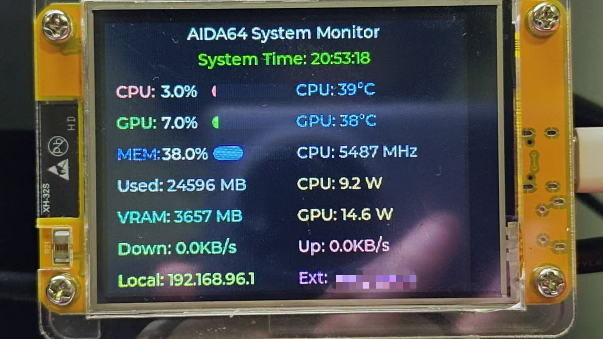

# ESP32_AIDA64_GP1294AI

🇨🇳 [中文版本](README_CN.md) | 🇺🇸 **English Version**

A wireless PC system monitor using ESP32-2432S028R development board with 2.8" TFT color display (240x320 resolution) to show AIDA64 system monitoring data, featuring WiFi time synchronization.



*Real-time system monitoring display showing CPU, GPU, memory, network stats, and IP addresses*

## Features
- 🖥️ **Real-time System Monitoring** - Display 14 system parameters including CPU, GPU, memory, and network
- 🌐 **WiFi Time Sync** - Automatic network time retrieval and display (timezone support)
- 📱 **Color TFT Display** - 2.8" ILI9341 screen for clear readability
- 🔄 **Auto Data Updates** - Real-time system data via AIDA64 SSE
- ⚡ **High-Performance UI** - Smooth interface based on LVGL 8.4.0 graphics library

## Hardware Requirements
+ **Development Environment**: VS Code + PlatformIO IDE
  > Board: Espressif ESP32 Dev Module, Framework: Arduino
+ **MCU**: ESP32-2432S028R development board (built-in 2.8" TFT display)
+ **Display**: 2.8" TFT LCD (ILI9341 driver, 240x320 resolution)
+ **Software**: AIDA64 (with RemoteSensor support)

## Display Content
The project supports displaying the following 14 system monitoring parameters:

### System Information
- **Current Time** - Automatic WiFi NTP sync (UTC+8 timezone)
- **CPU Usage** - Real-time CPU load percentage
- **CPU Temperature** - Processor temperature monitoring
- **CPU Frequency** - Current operating frequency
- **CPU Power** - Processor power consumption

### Graphics Information
- **GPU Usage** - Graphics card load percentage
- **GPU Temperature** - Graphics card temperature monitoring
- **GPU Power** - Graphics card power consumption
- **GPU Memory** - GPU memory usage

### Memory Information
- **Memory Usage** - System memory usage percentage
- **Used Memory** - Actual memory consumption

### Network Information
- **Download Speed** - Network download rate
- **Upload Speed** - Network upload rate
- **Local IP** - Local machine IP address
- **External IP** - Public IP address

## Setup Guide
### Step 1: Configure AIDA64
1. Open AIDA64 software, go to Settings -> LCD -> RemoteSensor
2. Enter a port number (e.g., 8080), check "Enable RemoteSensor LCD support"
3. Click Apply or OK

### Step 2: Import Display Configuration
1. In AIDA64, select "LCD Items"
2. Import either `aida64config/chinese.rslcd` (Chinese) or `aida64config/eng.rslcd` (English) from the project
3. Click OK

### Step 3: Verify Network Connection
Enter "Local IP:Port" in browser (e.g., http://192.168.1.100:8080) to verify AIDA64 panel is working. Test with other devices on the LAN to ensure firewall isn't blocking.

### Step 4: Configure ESP32 Parameters
Modify network and server settings in `include/config.h`:
```cpp
// WiFi Network Configuration
#define WIFI_SSID "Your_WiFi_Name"     // Replace with your WiFi name
#define WIFI_PASS "Your_WiFi_Password"  // Replace with your WiFi password

// AIDA64 Server Configuration
#define HTTP_HOST "192.168.1.100"      // Replace with your PC's IP address
#define HTTP_PORT 8080                 // AIDA64 RemoteSensor port

// Time Sync Configuration (optional)
#define TIME_UPDATE_INTERVAL 60000     // Time update interval (milliseconds)
```

**Important Notes:**
- Ensure ESP32 and PC are connected to the same WiFi network
- HTTP_HOST should be set to your PC's wireless adapter IP address
- ESP32 only supports 2.4GHz WiFi, not 5GHz bands

### Step 5: Hardware Connection
ESP32-2432S028R is an integrated development board with built-in 2.8" TFT display, no additional wiring required.

**Board Features:**
- ESP32-WROOM-32 main controller chip
- 2.8" TFT LCD display (ILI9341 driver)
- Resolution: 240x320 pixels
- Built-in touchscreen (not used in this project)
- USB power and programming

**Pin Configuration (pre-configured, no modification needed):**
```cpp
// TFT LCD Pin Configuration (ESP32-2432S028R)
#define TFT_MISO 12    // SPI MISO
#define TFT_MOSI 13    // SPI MOSI  
#define TFT_SCLK 14    // SPI Clock
#define TFT_CS   15    // Chip Select
#define TFT_DC   2     // Data/Command
#define TFT_RST  4     // Reset
#define TOUCH_CS 21    // Touch Chip Select (unused)
```

### Step 6: Compile and Upload
1. Connect ESP32-2432S028R to PC with USB-C cable
2. Compile the project in PlatformIO
3. Upload firmware to ESP32
4. After restart, ESP32 will automatically connect to WiFi and start displaying system monitoring data

## Project Structure
```
ESP32_AIDA64_GP1294AI/
├── src/                    # Source code
│   ├── main.cpp           # Main program
│   ├── display.cpp        # Display management
│   ├── wifi_client.cpp    # WiFi connection management
│   ├── http_client.cpp    # HTTP client and data parsing
│   └── time_manager.cpp   # Time sync management
├── include/               # Header files
│   ├── config.h          # Configuration file
│   ├── display.h         # Display related
│   └── time_manager.h    # Time management
├── aida64config/         # AIDA64 configuration files
│   ├── chinese.rslcd     # Chinese configuration
│   ├── eng.rslcd         # English configuration
│   └── example.rslcd     # Example configuration
├── lv_conf.h             # LVGL configuration
└── platformio.ini        # PlatformIO configuration
```

## Technical Specifications
- **MCU**: ESP32-WROOM-32 (Dual-core 240MHz)
- **Display**: LVGL 8.4.0 graphics library + ILI9341 driver
- **Network**: WiFi 802.11 b/g/n (2.4GHz)
- **Protocol**: HTTP/SSE (Server-Sent Events)
- **Time Sync**: NTP (Network Time Protocol)
- **Memory Usage**: RAM 31.4% (100KB), Flash 93.6% (1.2MB)

## Troubleshooting
1. **WiFi Connection Failed**: Check SSID/password correctness, confirm 2.4GHz network
2. **Cannot Get Data**: Verify AIDA64 settings and firewall configuration
3. **Display Issues**: Check TFT display connection and configuration
4. **Incorrect Time**: Check network connection and timezone settings

## Version History
- **v2.0** - Migration to ESP32-2432S028R + TFT color display
- **v1.5** - Added WiFi NTP time synchronization
- **v1.2** - Optimized LVGL interface, added system monitoring items
- **v1.0** - Initial version based on VFD display
