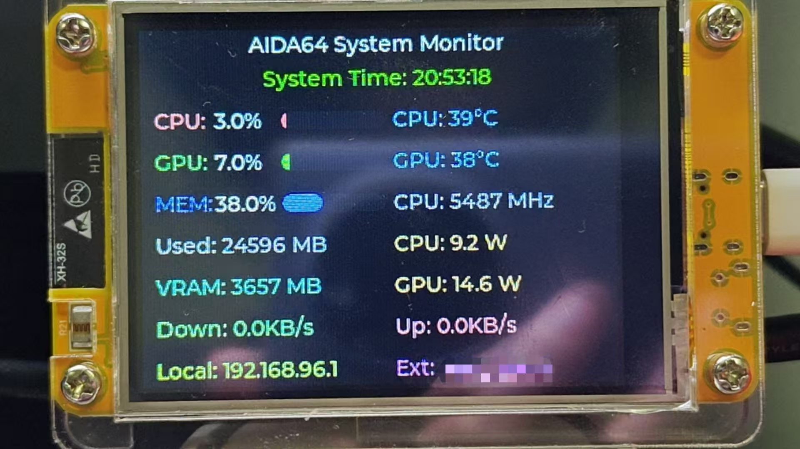

# ESP32_AIDA64_GP1294AI

🇨🇳 **中文版本** | 🇺🇸 [English Version](README.md)

本项目基于ESP32-2432S028R开发板，使用2.8寸TFT彩色显示屏（240x320分辨率）无线显示电脑AIDA64系统监控数据，支持WiFi时间同步。



*实时系统监控显示界面，显示CPU、GPU、内存、网络统计和IP地址*

## 项目特色
- 🖥️ **实时系统监控** - 显示CPU、GPU、内存、网络等14项系统参数
- 🌐 **WiFi时间同步** - 自动获取网络时间并显示（支持时区设置）
- 📱 **彩色TFT显示** - 2.8寸ILI9341屏幕，清晰易读
- 🔄 **自动数据更新** - 通过AIDA64 SSE实时获取系统数据
- ⚡ **高性能UI** - 基于LVGL 8.4.0图形库的流畅界面

## 硬件环境
+ **开发环境**: VS Code + PlatformIO IDE
  > Board: Espressif ESP32 Dev Module, Framework: Arduino
+ **主控**: ESP32-2432S028R开发板（内置2.8寸TFT显示屏）
+ **显示屏**: 2.8寸TFT LCD（ILI9341驱动，240x320分辨率）
+ **软件**: AIDA64 (支持RemoteSensor功能)

## 显示内容
项目支持显示以下14项系统监控数据：

### 系统信息
- **当前时间** - 通过WiFi NTP自动同步（UTC+8时区）
- **CPU使用率** - 实时CPU负载百分比
- **CPU温度** - 处理器温度监控
- **CPU频率** - 当前运行频率
- **CPU功耗** - 处理器功耗

### 显卡信息
- **GPU使用率** - 显卡负载百分比
- **GPU温度** - 显卡温度监控
- **GPU功耗** - 显卡功耗
- **显存使用** - GPU显存占用

### 内存信息
- **内存使用率** - 系统内存使用百分比
- **已用内存** - 实际内存占用量

### 网络信息
- **下载速度** - 网络下载速率
- **上传速度** - 网络上传速率
- **本地IP** - 本机IP地址
- **外部IP** - 公网IP地址

## 配置使用
### 步骤1: 配置AIDA64
1. 打开AIDA64软件，进入设置 -> LCD -> RemoteSensor
2. 输入一个端口号（如8080），勾选"启用RemoteSensor LCD支持"
3. 点击应用或确定

### 步骤2: 导入显示配置
1. 在AIDA64中选择"LCD项目"
2. 将项目中的 `aida64config/chinese.rslcd`（中文版）或 `aida64config/eng.rslcd`（英文版）导入
3. 点击确定

### 步骤3: 验证网络连接
在浏览器中输入"本地IP:端口号"（如 http://192.168.1.100:8080）验证AIDA64面板是否正常工作。建议用局域网内其他设备测试，确保防火墙没有屏蔽。

### 步骤4: 配置ESP32参数
修改 `include/config.h` 中的网络和服务器设置：
```cpp
// WiFi 网络配置
#define WIFI_SSID "Your_WiFi_Name"     // 替换为你的WiFi名称
#define WIFI_PASS "Your_WiFi_Password"  // 替换为你的WiFi密码

// AIDA64 服务器配置
#define HTTP_HOST "192.168.1.100"      // 替换为电脑的IP地址
#define HTTP_PORT 8080                 // AIDA64 RemoteSensor端口号

// 时间同步配置（可选）
#define TIME_UPDATE_INTERVAL 60000     // 时间更新间隔（毫秒）
```

**重要提示：**
- 确保ESP32和电脑连接同一个WiFi网络
- HTTP_HOST应设置为电脑无线网卡的IP地址
- ESP32只支持2.4GHz WiFi，不支持5GHz频段

### 步骤5: 硬件连接
ESP32-2432S028R是一体化开发板，内置2.8寸TFT显示屏，无需额外连线。

**开发板特性：**
- ESP32-WROOM-32主控芯片
- 2.8寸TFT LCD显示屏（ILI9341驱动）
- 分辨率：240x320像素
- 内置触摸屏（本项目未使用）
- USB供电和下载

**引脚配置（已预设，无需修改）：**
```cpp
// TFT LCD 引脚配置（ESP32-2432S028R）
#define TFT_MISO 12    // SPI MISO
#define TFT_MOSI 13    // SPI MOSI  
#define TFT_SCLK 14    // SPI 时钟
#define TFT_CS   15    // 片选
#define TFT_DC   2     // 数据/命令
#define TFT_RST  4     // 复位
#define TOUCH_CS 21    // 触摸屏片选（未使用）
```

### 步骤6: 编译和下载
1. 用USB-C线连接ESP32-2432S028R到电脑
2. 在PlatformIO中编译项目
3. 下载固件到ESP32
4. 重启后ESP32会自动连接WiFi并开始显示系统监控数据

## 项目结构
```
ESP32_AIDA64_GP1294AI/
├── src/                    # 源代码
│   ├── main.cpp           # 主程序
│   ├── display.cpp        # 显示管理
│   ├── wifi_client.cpp    # WiFi连接管理
│   ├── http_client.cpp    # HTTP客户端和数据解析
│   └── time_manager.cpp   # 时间同步管理
├── include/               # 头文件
│   ├── config.h          # 配置文件
│   ├── display.h         # 显示相关
│   └── time_manager.h    # 时间管理
├── aida64config/         # AIDA64配置文件
│   ├── chinese.rslcd     # 中文配置
│   ├── eng.rslcd         # 英文配置
│   └── example.rslcd     # 示例配置
├── lv_conf.h             # LVGL配置
└── platformio.ini        # PlatformIO配置
```

## 技术特性
- **MCU**: ESP32-WROOM-32（双核240MHz）
- **显示**: LVGL 8.4.0图形库 + ILI9341驱动
- **网络**: WiFi 802.11 b/g/n（2.4GHz）
- **协议**: HTTP/SSE（Server-Sent Events）
- **时间同步**: NTP（网络时间协议）
- **内存占用**: RAM 31.4% (100KB), Flash 93.6% (1.2MB)

## 故障排除
1. **WiFi连接失败**：检查SSID/密码是否正确，确认是2.4GHz网络
2. **无法获取数据**：验证AIDA64设置和防火墙配置
3. **显示异常**：检查TFT显示屏连接和配置
4. **时间不准确**：检查网络连接和时区设置

## 更新日志
- **v2.0** - 迁移到ESP32-2432S028R + TFT彩色显示
- **v1.5** - 添加WiFi NTP时间同步功能  
- **v1.2** - 优化LVGL界面，增加系统监控项目
- **v1.0** - 初始版本，基于VFD显示屏
